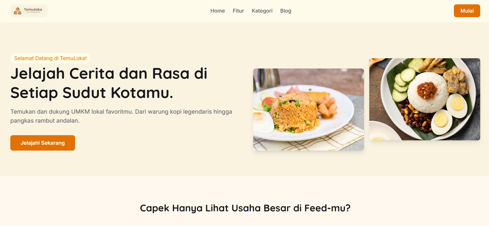
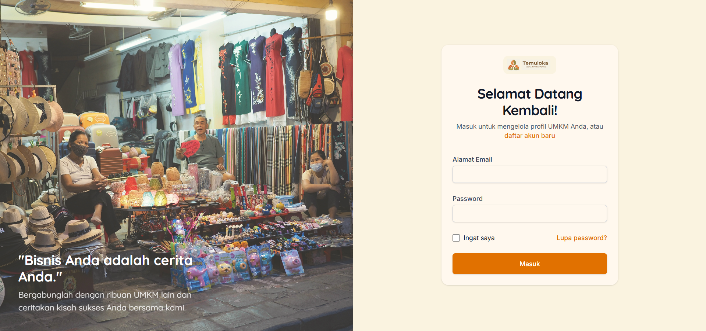

# 📋 TemuLoka - Website Direktori UMKM


Platform direktori UMKM modern untuk menemukan dan mendukung usaha mikro, kecil, dan menengah di sekitar .


### Techstack
- **HTML**
- **CSS**
- **Vue.js 3** 
- **Tailwind CSS** 


### Prerequisites
- Node.js 16.0 atau lebih tinggi
- npm atau yarn

### Setup Development

1. **Clone repository**
```bash
git clone https://github.com/farhansyahbanna/TemuLoka.git
cd TemuLoka
```

2. **Install dependencies**
```bash
npm install
```

3. **Jalankan development server**
```bash
npm run dev
```

### Progres Saat Ini

# Landing Page


# Halaman Direktori UMKM


# Login & Register

